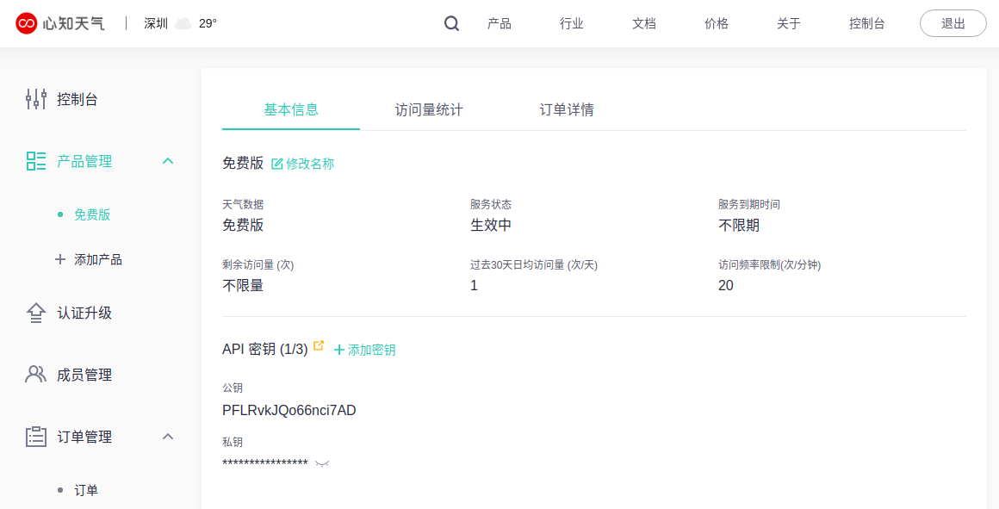

## 从心知天气网获取天气信息


### [心知天气](https://www.seniverse.com/)

https://www.seniverse.com/

IP：116.62.93.248

Port：80

通过socket获取http数据；


### 获取私钥


获取私钥，需要先在心知天气网注册一个账号，并在产品管理中添加一个免费版天气项；




如上图所示，从“控制台”-->“产品管理”-->“免费版”-->“API密钥”-->“私钥”，可以获取到属于自己账户的私钥；


private:
SBx4_FIjI6Y5CDu4V

public:
PFLRvkJQo66nci7AD


#### 参数

|  参数名  |                             类型                             | 默认值  | 必须 |     备注      |
| :------: | :----------------------------------------------------------: | :-----: | :--: | :-----------: |
|   key    |                            String                            |   无    |  是  | 你的 API 密钥 |
| location | [Location](https://docs.seniverse.com/api/start/common.html#地点-location) |   无    |  是  | 所查询的位置  |
| language | [Language](https://docs.seniverse.com/api/start/common.html#语言-language) | zh-Hans |  否  |     语言      |
|   unit   | [Unit](https://docs.seniverse.com/api/start/common.html#单位-unit) |    c    |  否  |     单位      |


### 获取当天的天气信息


在“天气类”-->“[天气实况](https://docs.seniverse.com/api/weather/now.html)”中，有较为详细的操作说明；


#### 请求地址

https://api.seniverse.com/v3/weather/now.json?key=your_private_key&location=shenzhen&language=zh-Hans&unit=c


#### 返回结果


```
{"results":[{"location":{"id":"WS10730EM8EV","name":"深圳","country":"CN","path":"深圳,深圳,广东,中国","timezone":"Asia/Shanghai","timezone_offset":"+08:00"},"now":{"text":"阴","code":"9","temperature":"30"},"last_update":"2020-07-01T18:09:00+08:00"}]}
```


#### cJSON解析


```
{
    "results":  [{  
            "location": {
                "id":   "WS10730EM8EV",
                "name": "深圳",
                "country":  "CN",
                "path": "深圳,深圳,广东,中国",
                "timezone": "Asia/Shanghai",
                "timezone_offset":  "+08:00"
            },
            "now":  {
                "text": "阴",
                "code": "9",
                "temperature":  "30"
            },
            "last_update":  "2020-07-01T18:09:00+08:00"
        }]
}
```


### 获取最近三天的天气信息


#### 请求地址

https://api.seniverse.com/v3/weather/daily.json?key=your_private_key&location=shenzhen&language=zh-Hans&unit=c


#### 返回结果

```
{"results":[{"location":{"id":"WS10730EM8EV","name":"深圳","country":"CN","path":"深圳,深圳,广东,中国","timezone":"Asia/Shanghai","timezone_offset":"+08:00"},"daily":[{"date":"2020-07-01","text_day":"雷阵雨","code_day":"11","text_night":"雷阵雨","code_night":"11","high":"33","low":"26","rainfall":"6.3","precip":"","wind_direction":"无持续风向","wind_direction_degree":"165","wind_speed":"16.20","wind_scale":"3","humidity":"86"},{"date":"2020-07-02","text_day":"雷阵雨","code_day":"11","text_night":"雷阵雨","code_night":"11","high":"31","low":"26","rainfall":"11.2","precip":"","wind_direction":"南","wind_direction_degree":"188","wind_speed":"25.20","wind_scale":"4","humidity":"87"},{"date":"2020-07-03","text_day":"雷阵雨","code_day":"11","text_night":"雷阵雨","code_night":"11","high":"31","low":"27","rainfall":"6.3","precip":"","wind_direction":"南","wind_direction_degree":"170","wind_speed":"25.20","wind_scale":"4","humidity":"81"}],"last_update":"2020-07-01T17:19:58+08:00"}]}
```


#### cJSON解析

```
{
    "results":  [{
            "location": {
                "id":   "WS10730EM8EV",
                "name": "深圳",
                "country":  "CN",
                "path": "深圳,深圳,广东,中国",
                "timezone": "Asia/Shanghai",
                "timezone_offset":  "+08:00"
            },
            "daily":    [{
                    "date": "2020-07-01",
                    "text_day": "雷阵雨",
                    "code_day": "11",
                    "text_night":   "雷阵雨",
                    "code_night":   "11",
                    "high": "33",
                    "low":  "26",
                    "rainfall": "6.3",
                    "precip":   "",
                    "wind_direction":   "无持续风向",
                    "wind_direction_degree":    "165",
                    "wind_speed":   "16.20",
                    "wind_scale":   "3",
                    "humidity": "86"
                }, {
                    "date": "2020-07-02",
                    "text_day": "雷阵雨",
                    "code_day": "11",
                    "text_night":   "雷阵雨",
                    "code_night":   "11",
                    "high": "31",
                    "low":  "26",
                    "rainfall": "11.2",
                    "precip":   "",
                    "wind_direction":   "南",
                    "wind_direction_degree":    "188",
                    "wind_speed":   "25.20",
                    "wind_scale":   "4",
                    "humidity": "87"
                }, {
                    "date": "2020-07-03",
                    "text_day": "雷阵雨",
                    "code_day": "11",
                    "text_night":   "雷阵雨",
                    "code_night":   "11",
                    "high": "31",
                    "low":  "27",
                    "rainfall": "6.3",
                    "precip":   "",
                    "wind_direction":   "南",
                    "wind_direction_degree":    "170",
                    "wind_speed":   "25.20",
                    "wind_scale":   "4",
                    "humidity": "81"
                }],
            "last_update":  "2020-07-01T17:19:58+08:00"
        }]
}
```


### 数据处理


返回的结果是以json格式的字符串，解析时可以使用cJSON工具进行解析，得出自己需要的数据信息；


### 参考资料

https://blog.csdn.net/zhengnianli/article/details/95070044


